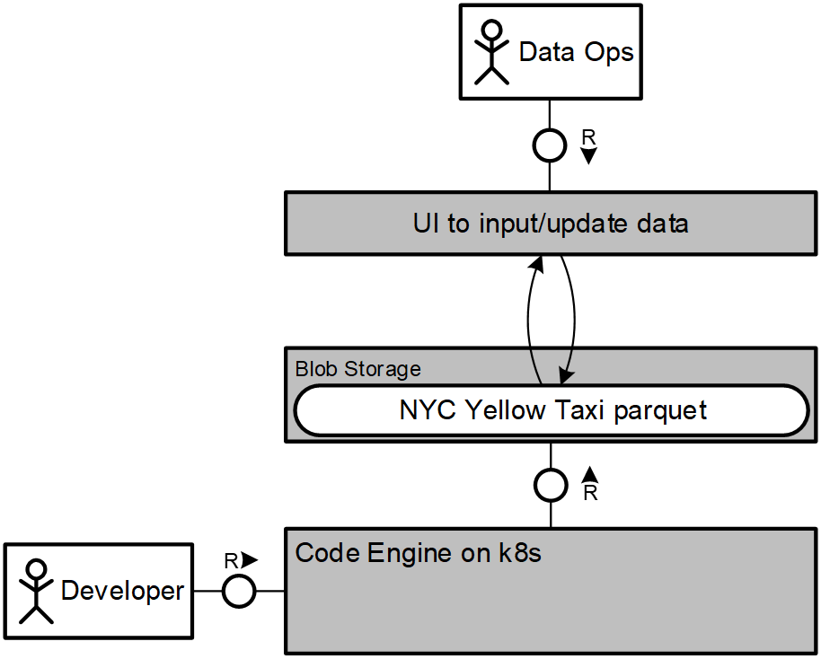

NYC Yellow Taxi Challenge:
================================

#### Disclaimer:
*For this challenge i used the data "as-is" from the website. During my analysis i saw some data quality issues, which delivers averages for a certain month with some date outside of the month. But the data quality issues is not the focus here. We assume IF data quality is perfect, current issues would not be visible. From unit tests point of view, i know it is really basic (not optimal) and needs some more tweaking.*

### Issues:

- After loading parquet files, there are rows of data outside of the time range of the specific month. This leads specially in the 45 rolling average to some errors. 

### Remark:

For this challenge, it is known that the datasets are quite huge. Storing the data as parquet was for me the logical consequence to better work with it. Since i am new to parquet, i didn't use all possibilities which it gives us (i.e. metadata, partitioning etc.)

Normally, this would be stored on a Blob Storage, but since i wanted to work locally i stored the parquet files locally. But the calculation logic shouldn't need drastic changes, if a Blob Storage should be used instead.

If new data is stored the same way like i did (naming convention), the code could also run on new incoming data for 2021 onwards.
Of course in an enterprise setup there would be a different architecture for how to save, store the data and also insuring a good data quality.

Here is an example of an architecture could look like, since the size of the NYC Yellow Taxi dataset is from my personal view too big for a traditional SQL database.

##### Picture 1: Architecture

### Some thoughts on scaling if data size does not fit into one machine
- Blob Storage:

    If we would like to have the full NYC Yellow Taxi dataset, it would already be too much for the RAM of most computers. Storing this on a Data Lake (favourable at a Hyperscaler) gives us the option to deal with the data better, even if the data grows even more. And with the partitioning features of parquet, it is "request optimized" meaning we only select/call the data that is needed and not the full dataset.
    
    In a distributed fashion, we would then calculate only in batches, so it can be handled and be scaled. 

- Scalable environment to the run the pipeline:

    Since we now have the option to calculated over batches, we can then try to use the strength of K8s to run pods in parallel for faster execution of a bigger task. For example, we would like to know the average trip length over the past 10 years. Then a possible setup could be to calculate each year per one pod. So it's processing 10 threats (pods) in parallel.